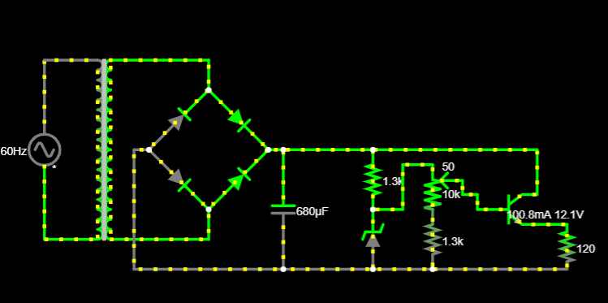

# Eletronics-PowerSupply
O projeto solicitado na disciplina de [SSC0180] – Eletrônica para Computação ministrada pelo professor Eduardo do Valle Simões, da USP envolve a criação de uma fonte de tensão retificadora ajustável. A fonte deve ser capaz de fornecer uma tensão ajustável entre 3V e 12V, com uma corrente mínima de 100mA. 

| Alunos | N°USP |
|----------|----------|
| Felipe Eduardo Dias Tavares | 13713184 |
| Letícia Pinheiro Ferreira | 12683381 |

# Objetivo
Projetar uma fonte de tensão retificadora, ajustável entre 3V e 12V, com capacidade de 100mA.

## &#128161; Componentes utilizados:

* Transformador:

É um componente que muda a tensão elétrica em um circuito. Ele pode aumentar ou diminuir o valor da tensão, dependendo das necessidades do circuito.

* Ponte de diodo:

É um dispositivo usado para converter corrente alternada em corrente contínua. Ele retifica a corrente, permitindo que o circuito seja alimentado em ambas as direções da corrente alternada.

* Capacitor:

É um componente que armazena cargas elétricas. Ele é usado para acumular energia elétrica e liberá-la quando necessário.

* Diodo de Zener:

É um tipo especial de diodo que é usado para regular a tensão em um circuito. Ele mantém a tensão constante em um valor específico, mesmo quando ocorrem variações.

* Resistores:

São componentes usados para controlar o fluxo de corrente elétrica em um circuito. Eles limitam ou ajustam a quantidade de corrente que flui em um determinado caminho.

* Potenciômetro:

É um componente de resistência variável. Ele permite ajustar a voltagem ou a corrente em um circuito, permitindo controlar o fluxo de eletricidade.

* Transistor:

É um componente eletrônico que pode atuar como um interruptor controlado por um sinal elétrico ou amplificar um sinal elétrico. Ele desempenha um papel importante em circuitos eletrônicos, permitindo controlar o fluxo de corrente de acordo com as necessidades do circuito.

# Diagrama da Fonte

[Link para o circuito no Falstad](https://tinyurl.com/yengesgj) 

## :heavy_dollar_sign: Preço dos componentes:

| Quantidade | Componente          | Valor   |
|------------|---------------------|---------|
| 1         | Transformador       | R$63,99 |
| 1          | Ponte de Diodos     | R$6,67  |
| 1          | Capacitor           | R$1,10  |
| 1          | LED                 | R$0,70  |
| 1          | Diodo Zener         | R$0,19  |
| 2          | Potenciômetro       | R$13,58 |
| 1          | Resistor 680        | R$0,38  |
| 1          | Resistor 1k         | R$0,18  |
| 1          | Resistor 3k9        | R$0,38  |
| 2          | Jumper macho x macho| R$13,58 |
| Total      |                     |R$127,81 |

# Projeto Esquemático do PCB no Software Eagle

### Capacitor 

$$Ripple = \frac{Vs}{2 \cdot f \cdot C \cdot Req}$$

Onde:

- $Vs$ é a tensão de saída
- $f$ é a frequência
- $C$ é a capacitância
- $Req$ é a resistência de carga

Vamos substituir os valores fornecidos na fórmula:

$$Ripple = \frac{23.506 V}{2 \cdot 120 Hz \cdot 680 \cdot 10^{-6} F \cdot 224.43 \Omega}$$

Agora, vamos calcular isso:

Primeiro, calcule o valor do denominador: 

$$2 \cdot f \cdot C \cdot Req = 2 \cdot 120 Hz \cdot 680 \cdot 10^{-6} F \cdot 224.43 \Omega = 36.5$$

Em seguida, divida a tensão de saída pelo valor calculado: 

$$Ripple = \frac{23.506 V}{36.5} = 0.644 V$$

Portanto, o ripple na saída da fonte de alimentação é de aproximadamente $$0.644 Volts.$$

Porcentagem:
$$\text{Porcentagem do Ripple} = \left(\frac{\text{Ripple}}{Vs}\right) \cdot 100$$

$$\text{Porcentagem do Ripple} = \left(\frac{0.644 V}{23.506 V}\right) \cdot 100 = 2.73 \text{\\%}$$
