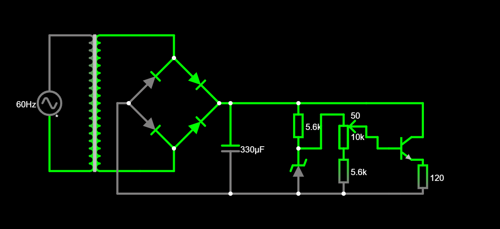

# Eletronics-PowerSupply
O projeto solicitado na disciplina de [SSC0180] – Eletrônica para Computação ministrada pelo professor Eduardo do Valle Simões, da USP envolve a criação de uma fonte de tensão retificadora ajustável. A fonte deve ser capaz de fornecer uma tensão ajustável entre 3V e 12V, com uma corrente mínima de 100mA. 

| Alunos | N°USP |
|----------|----------|
| Felipe Eduardo Dias Tavares | 13713184 |
| Letícia Pinheiro Ferreira | 12683381 |

# Objetivo
Projetar uma fonte de tensão retificadora, ajustável entre 3V e 12V, com capacidade de 100mA.

## &#128161; Componentes utilizados:

* Transformador:

É um componente que muda a tensão elétrica em um circuito. Ele pode aumentar ou diminuir o valor da tensão, dependendo das necessidades do circuito.

* Ponte de diodo:

É um dispositivo usado para converter corrente alternada em corrente contínua. Ele retifica a corrente, permitindo que o circuito seja alimentado em ambas as direções da corrente alternada.

* Capacitor:

É um componente que armazena cargas elétricas. Ele é usado para acumular energia elétrica e liberá-la quando necessário.

* Diodo de Zener:

É um tipo especial de diodo que é usado para regular a tensão em um circuito. Ele mantém a tensão constante em um valor específico, mesmo quando ocorrem variações.

* Resistores:

São componentes usados para controlar o fluxo de corrente elétrica em um circuito. Eles limitam ou ajustam a quantidade de corrente que flui em um determinado caminho.

* Potenciômetro:

É um componente de resistência variável. Ele permite ajustar a voltagem ou a corrente em um circuito, permitindo controlar o fluxo de eletricidade.

* Transistor:

É um componente eletrônico que pode atuar como um interruptor controlado por um sinal elétrico ou amplificar um sinal elétrico. Ele desempenha um papel importante em circuitos eletrônicos, permitindo controlar o fluxo de corrente de acordo com as necessidades do circuito.

# Diagrama da Fonte

[Link para o circuito no Falstad](https://tinyurl.com/yengesgj) 

## :heavy_dollar_sign: Preço dos componentes:

| Quantidade | Componente          | Valor   |
|------------|---------------------|---------|
| 1         | Transformador       | R$27,99 |
| 1          | Ponte de Diodos     | R$3,67  |
| 1          | Capacitor           | R$1,10  |
| 1          | LED                 | R$0,70  |
| 1          | Diodo Zener         | R$0,19  |
| 2          | Potenciômetro       | R$13,58 |
| 1          | Resistor 680        | R$0,38  |
| 1          | Resistor 1k         | R$0,18  |
| 1          | Resistor 3k9        | R$0,38  |
| 2          | Jumper macho x macho| R$13,58 |
| Total      |                     | R$61,75 |

# Projeto Esquemático do PCB no Software Eagle

## Contas

### Tensão

Tensão da entrada da fonte: 

Tensão de pico da entrada da fonte: 

Razão transformador: 

Tensão pico após transformador: 

Tensão pico após diodos: 

Ripple de 10%: 

Tensão mínima no circuito: 

Tensão média: 

### Corrente

Corrente carga: 

Corrente LED: 

Corrente Zener: 

Corrente potenciometro: 

Corrente total: 

### Capacitor 

C = () / () = 

